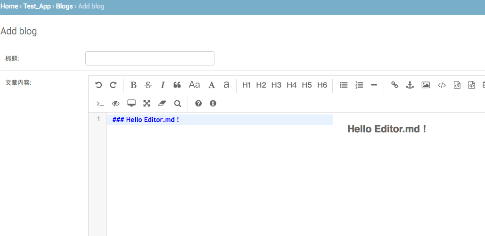

# django-editor-md
>Django markdown text editor extend by [editor.md](https://github.com/pandao/editor.md)

# How to use?
### Install

    git clone https://github.com/fcfangcc/django-editor-md.git
    cd django-editor-md
    python setup.py install

### Add "editor_md" to setting.py INSTALLED_APPS

    # setting.py
    INSTALLED_APPS = [
    ......
    'editor_md',
]
### Add editor_md.urls in urls

    # urls.py
    urlpatterns = [
    ......
    url(r'', include('editor_md.urls')),
    ]
### Use it in models

    # models.py
    from editor_md.models import EditorMdField
    class Blog(models.Model):
        title = models.CharField(max_length=100, verbose_name="标题", blank=True)
        content = EditorMdField(imagepath="editor_md_image/",verbose_name="文章内容", blank=True)
    # image will save to media/editor_md_image/

### Use in html templates

    # views.py
    ......
    def show_test(request):
    if request.method == "GET":
        b = Blog.objects.last()
        form = EditorTestForm(instance=b)
        return render(request, 'show_test.html', {'form': form})

    # show_test.html
    ......
    <head>
        ......
        {{ form.media }}
    </head>
    <body>
    ......
    <textarea id="markdown" style="display: none">{{ form.content.value }}</textarea>
    

        <textarea id="markdown_html" style="display:none;"></textarea>'
    

    
    </body>
    </html>

### Use in admin

    # admin.py
    from django.contrib import admin
    from .models import Blog
    class BlogAdmin(admin.ModelAdmin):
        list_display = ("title",)
    admin.site.register(Blog, BlogAdmin)

Open admin manager http://127.0.0.1:8000/admin/.
Add you model ,editor.md  windows on web.
 

# Example App

    git clone https://github.com/fcfangcc/django-editor-md.git
    cd django-editor-md
    python manage.py runserver
    # browser to http://127.0.0.1:8000/test
    username:editormd
    password:editormd